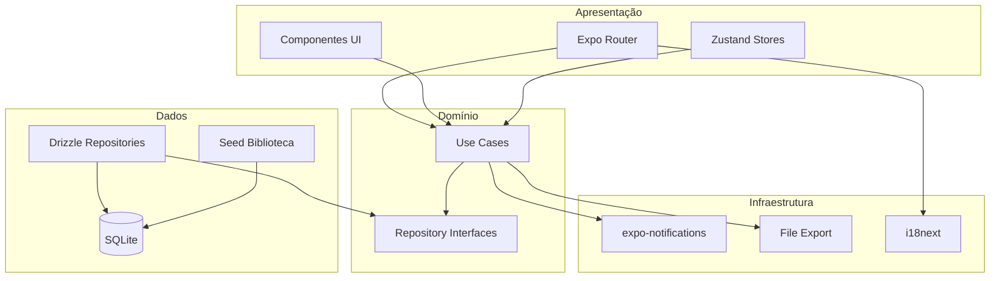
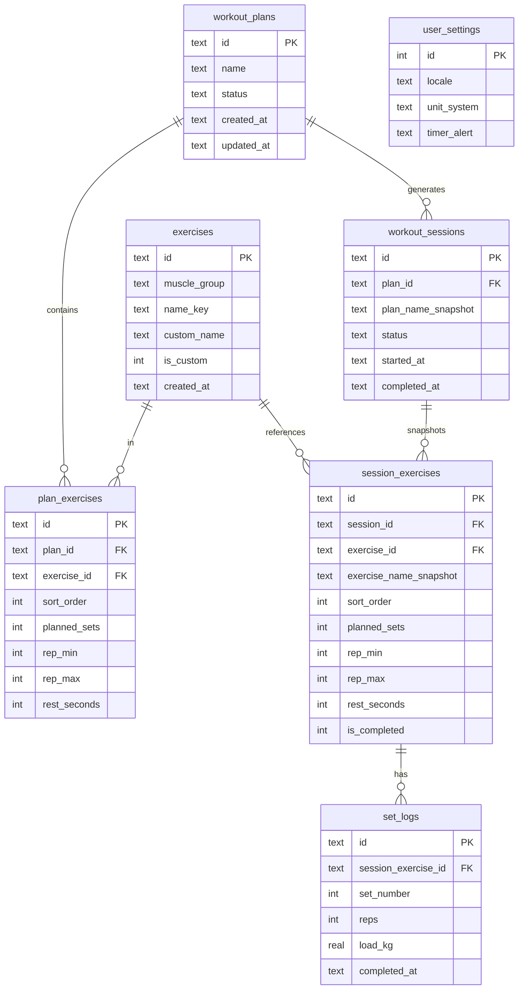

# Arquitetura — Fitness Tracker (Baseline)

> **Escopo:** Baseline global do sistema  
> **Origem:** `PRD.md`, `.specs/index.md`  
> **Estilo:** App mobile monolítico modular (camadas)  
> **Data:** 2026-07-05  
> **Gerado por:** Arquiteto de Software (skill)

---

## Resumo executivo

O Fitness Tracker será um **app mobile offline-first** em **React Native + Expo (TypeScript)**, organizado como monolito modular com camadas **UI → domínio → dados**. Persistência local via **expo-sqlite + Drizzle ORM** com migrações versionadas. Não há backend no MVP: todos os dados ficam no sandbox do dispositivo. O timer de descanso usa **notificação local** (`expo-notifications`) para alertar com app minimizado. i18n cobre pt-BR, es-ES e en-US; cargas armazenadas em kg com conversão na UI. Projeto solo — prioriza simplicidade, testabilidade de use cases e evolução incremental por feature.

---

## Contexto e escopo técnico

| Item | Descrição |
|------|-----------|
| **Objetivo técnico** | App multiplataforma (iOS/Android) que substitui bloco de notas: fichas, sessão de treino, métricas, calendário e exportação — 100% offline |
| **Fora de escopo técnico** | Backend, auth, nuvem, sync, push remoto, wearables, importação de backup |
| **Features (`.specs/`)** | BibliotecaExercicios, GerenciamentoFichas, SessaoTreino, CalendarioTreinos, EvolucaoProgresso, ExportacaoHistorico, ConfiguracoesApp |
| **Sistemas externos** | Apenas APIs do SO: filesystem, share sheet, notificações locais, haptics |

---

## Stack e tecnologias

| Camada | Tecnologia | Versão / nota | Justificativa |
|--------|------------|---------------|---------------|
| Runtime | Expo SDK | **Última estável no `npx create-expo-app`** | Defaults de plataforma; EAS opcional |
| Linguagem | TypeScript | Strict mode | Segurança de tipos; alinhado a Drizzle |
| UI / navegação | Expo Router | File-based routing | Padrão Expo moderno; deep links futuros |
| Estado UI | Zustand | Leve | Sessão de treino ativa, timer em memória |
| Persistência | expo-sqlite | Sync API | Offline-first nativo |
| ORM | Drizzle ORM | `drizzle-orm/expo-sqlite` | Schema tipado, migrações, queries type-safe |
| i18n | i18next + expo-localization | — | 3 idiomas; locale do dispositivo no 1º uso |
| Gráficos | victory-native | — | Evolução temporal (RF-12); avaliar bundle size |
| Timer BG | expo-notifications | Local scheduled | Alerta ao fim do descanso com app minimizado |
| Feedback | expo-haptics | — | Vibração configurável (RN alerta timer) |
| Exportação | expo-file-system + expo-sharing | — | JSON/CSV + share sheet nativo |
| Testes | Jest + React Native Testing Library | — | Use cases e componentes críticos |
| Lint / format | ESLint + Prettier | Expo preset | Consistência em projeto solo |
| Build | EAS Build | Opcional | Quando publicar nas stores |

### Versões mínimas de plataforma

Seguir **defaults do Expo SDK adotado** na criação do projeto (referência SDK 52+: **iOS 15.1+**, **Android 7+** / API 24+). Registrar em `app.json` após `create-expo-app`. Xcode conforme [documentação do SDK](https://docs.expo.dev/versions/latest/).

### Padrões arquiteturais adotados

- **Monolito modular** com **Clean Architecture simplificada**
- **Repository pattern** — UI e use cases não acessam SQLite diretamente
- **Use cases** por capability de negócio (um arquivo por operação significativa)
- **Snapshot imutável** de sessão — RN-03: histórico não muda ao editar ficha
- **Unidade canônica** — cargas sempre em `kg` no banco; conversão só na borda (UI/export)
- **Convenção de pastas** — ver seção Estrutura do projeto

---

## Estrutura do projeto

```
fitness_tracker/
├── app/                          # Expo Router (telas)
│   ├── (tabs)/                   # Home, fichas, evolução, calendário, config
│   ├── workout/[sessionId].tsx   # Sessão ativa
│   └── _layout.tsx
├── src/
│   ├── domain/
│   │   ├── entities/             # Exercise, WorkoutPlan, Session, SetLog...
│   │   ├── repositories/         # Interfaces (IExerciseRepository, etc.)
│   │   └── use-cases/              # LogSet, CompleteWorkout, ExportData...
│   ├── data/
│   │   ├── db/
│   │   │   ├── schema.ts           # Drizzle schema
│   │   │   ├── migrations/         # SQL migrations
│   │   │   └── client.ts           # SQLite singleton
│   │   ├── repositories/           # Implementações Drizzle
│   │   └── mappers/                # DB row ↔ entity
│   ├── infrastructure/
│   │   ├── notifications/        # Timer rest scheduler
│   │   ├── export/                 # JsonExporter, CsvExporter
│   │   └── seed/                   # Biblioteca curada inicial
│   ├── ui/                         # Componentes compartilhados
│   ├── stores/                     # Zustand (activeSession, timer)
│   ├── i18n/                       # pt-BR, es-ES, en-US + exercise keys
│   └── lib/
│       ├── units.ts                # kg ↔ lb
│       └── dates.ts
├── assets/
├── app.json
├── drizzle.config.ts
└── package.json
```

### Regras de dependência entre camadas

```
app → use-cases → repository interfaces
data/repositories → implementa interfaces → db/schema
infrastructure → use-cases (via injeção) / data
domain → não importa de app, data ou infrastructure
```

**Proibido:** importar `schema.ts` ou SQL de telas (`app/`).

---

## Visão de componentes



### Módulos de domínio e ownership

| Módulo | Responsabilidade | Feature `.specs/` |
|--------|------------------|-------------------|
| `exercises` | Biblioteca curada + customizados | BibliotecaExercicios |
| `plans` | Fichas e exercícios planejados | GerenciamentoFichas |
| `sessions` | Sessão ativa, séries, conclusão | SessaoTreino |
| `calendar` | Projeção de dias treinados | CalendarioTreinos |
| `analytics` | Carga, volume, PRs, gráficos | EvolucaoProgresso |
| `export` | Serialização dump completo | ExportacaoHistorico |
| `settings` | Locale, unidades, alerta timer | ConfiguracoesApp |

### Fronteiras e ownership de dados

| Entidade / Agregado | Dono | Consumidores | Observação |
|---------------------|------|--------------|------------|
| `Exercise` | exercises | plans, sessions | `isCustom` distingue seed vs usuário |
| `WorkoutPlan` | plans | sessions | Status: `active` \| `archived` |
| `WorkoutSession` | sessions | calendar, analytics, export | Snapshot JSON da ficha no `startedAt` |
| `SetLog` | sessions | analytics | `loadKg` canônico |
| `UserSettings` | settings | todos | Singleton (1 linha) |
| PRs (carga/volume) | analytics | UI evolução | Calculado ou cache; ver ADR-004 |

---

## Modelo de dados (Drizzle / SQLite)

### Diagrama ER (simplificado)



### Decisões de modelagem

| Tópico | Decisão |
|--------|---------|
| IDs | UUID v4 (`text`) — sem colisão offline |
| Timestamps | ISO 8601 UTC (`text`) — ordenação lexicográfica |
| Snapshot RN-03 | Ao iniciar sessão, copiar `plan_exercises` → `session_exercises` + `plan_name_snapshot` |
| Exercício custom | `is_custom=1`, `custom_name` preenchido; `name_key` null |
| Exercício seed | `is_custom=0`, `name_key` para i18n (ex.: `exercise.bench_press`) |
| Múltiplos treinos/dia | Permitido; calendário agrupa por `date(completed_at)` |
| Exclusão | Fichas: só `archived`; exercícios custom: soft-delete se sem vínculo (flag `deleted_at`) |
| Migrações | Drizzle Kit gera SQL; versão em `__drizzle_migrations` |

### Seed da biblioteca

- Arquivo `src/infrastructure/seed/exercises.json` com ~8–12 exercícios por grupo muscular
- Grupos: `chest`, `back`, `legs`, `shoulders`, `biceps`, `triceps`, `abs`, `glutes`
- Executado na primeira migração ou `onFirstLaunch` idempotente (`INSERT OR IGNORE`)

---

## Comunicação e contratos

### APIs REST / backend

*Não aplicável no MVP.* Toda comunicação é intra-app (use case → repository).

### Contratos internos (interfaces de repositório)

| Interface | Operações principais |
|-----------|---------------------|
| `IExerciseRepository` | `listByMuscleGroup`, `search`, `createCustom`, `softDeleteCustom` |
| `IPlanRepository` | `create`, `update`, `duplicate`, `archive`, `listActive` |
| `ISessionRepository` | `start`, `getActive`, `logSet`, `completeExercise`, `completeSession` |
| `ICalendarRepository` | `getDaysWithWorkouts(month)`, `getSessionsByDate` |
| `IAnalyticsRepository` | `getLoadHistory`, `getWeeklyVolume`, `getPRs` |
| `IExportRepository` | `exportFullDump(format: 'json' \| 'csv')` |
| `ISettingsRepository` | `get`, `update` |

### Eventos internos (opcional)

| Evento | Produtor | Consumidor | Uso |
|--------|----------|------------|-----|
| `session.completed` | `CompleteSessionUseCase` | Calendar refresh, analytics cache | Desacoplamento UI |

Implementação inicial: **callbacks** ou invalidação Zustand; event bus só se complexidade crescer.

### Integrações externas (SO)

| Sistema | Pacote | Timeout / SLA | Fallback |
|---------|--------|---------------|----------|
| Notificações locais | expo-notifications | Agendamento imediato | Alerta in-app se permissão negada |
| Share / save | expo-sharing | Síncrono | Mensagem de erro; retry manual |
| Haptics | expo-haptics | Síncrono | Silencioso se indisponível |

---

## Timer de descanso (decisão técnica)

### Fluxo

1. Usuário registra série → `LogSetUseCase` calcula `endsAt = now + restSeconds`
2. `RestTimerService.schedule(sessionId, exerciseId, endsAt)` cancela notificação anterior da sessão
3. Agenda notificação local com ID determinístico (`rest-{sessionId}`)
4. UI exibe countdown via Zustand (atualização a cada 1s em foreground)
5. Ao disparar notificação: som/vibração conforme `UserSettings.timerAlert`
6. Permissão de notificação solicitada no primeiro treino (não no onboarding)

### App minimizado

- Countdown em UI pausa; **notificação local garante alerta** no horário
- Ao retornar ao app, Zustand recalcula tempo restante de `endsAt`

---

## Internacionalização e unidades

| Aspecto | Abordagem |
|---------|-----------|
| UI strings | `i18next` — arquivos `pt-BR`, `es-ES`, `en-US` em `src/i18n/locales/` |
| Exercícios seed | `name_key` → `t('exercises.bench_press')` |
| Exercícios custom | `custom_name` exibido sem tradução |
| 1º launch | `expo-localization` → locale; fallback `en-US` se não suportado |
| Unidades | `UserSettings.unitSystem`: `metric` \| `imperial` |
| Conversão | `lib/units.ts`: `kgToLb`, `lbToKg`; display arredonda 1 decimal |
| Persistência | Sempre `load_kg REAL` em `set_logs` |

---

## Exportação (dump completo)

### Formato JSON (canônico)

```json
{
  "version": "1.0",
  "exportedAt": "2026-07-05T00:00:00.000Z",
  "settings": { },
  "exercises": [ ],
  "plans": [ ],
  "sessions": [ ]
}
```

### CSV

- Múltiplos arquivos em ZIP **ou** CSV único de `set_logs` flatten — **spike recomendado**; MVP aceita JSON principal + CSV de séries.

### Fluxo

`ExportFullDumpUseCase` → repositórios leem todas as tabelas → `JsonExporter` / `CsvExporter` → `expo-file-system` write → `expo-sharing.shareAsync`.

---

## Segurança

### Classificação de dados

| Dado | Sensibilidade | Armazenamento | Retenção |
|------|---------------|---------------|----------|
| Treinos, cargas, fichas | Pessoal (baixo) | SQLite app sandbox | Até usuário desinstalar ou apagar |
| Configurações | Pessoal (baixo) | SQLite | Idem |
| Exportação | Pessoal (baixo) | Arquivo escolhido pelo usuário | Fora do controle do app |

### Autenticação e autorização

| Recurso | Mecanismo | Regra |
|---------|-----------|-------|
| Todo o app | Nenhum (single-user local) | Acesso = desbloqueio do dispositivo (OS) |

Sem auth no MVP. Superfície de ataque limitada ao sandbox e arquivo exportado.

### Controles obrigatórios

- [x] Dados apenas no sandbox do app (sem network egress obrigatório)
- [x] Exportação somente por ação explícita do usuário
- [x] Validação de entrada nos use cases (reps ≥ 0, carga ≥ 0, séries ≥ 1)
- [x] Sem secrets em código ou repositório
- [x] Logs de dev sem dumps de SQLite em produção
- [x] Dependências auditadas (`npm audit`) antes de release
- [ ] Opcional: SQLCipher se requisito futuro de criptografia em repouso

### Threat model (resumido)

| Ameaça | Superfície | Mitigação |
|--------|------------|-----------|
| Acesso físico ao aparelho | App aberto | Depende de lock screen do OS; fora do escopo MVP |
| Exportação compartilhada indevidamente | Share sheet | UX clara; usuário controla destino |
| SQLite injection | Queries | Drizzle parametrizado; sem SQL dinâmico concatenado |
| Supply chain | npm | Lockfile, audit, poucas dependências |

### Auditoria e compliance

| Evento | Registrar | Retenção |
|--------|-----------|----------|
| Nenhum obrigatório no MVP | — | LGPD/GDPR baixo risco: sem conta, sem servidor, sem analytics |

---

## Requisitos não funcionais

| Categoria | Requisito | Meta / abordagem |
|-----------|-----------|------------------|
| Performance | Registrar série | Use case + insert Drizzle ≤ 500 ms |
| Performance | Gráficos 1 ano | Query indexada por `exercise_id` + `completed_at`; victory-native lazy |
| Disponibilidade | Offline | Zero chamadas de rede no MVP |
| Usabilidade | ≤ 3 toques por série | Bottom sheet de input; última carga pré-preenchida |
| i18n | 3 idiomas | CI check: script valida chaves iguais nos 3 locales |
| Armazenamento | Migrações | Drizzle migrations testadas em upgrade path |
| Manutenibilidade | Projeto solo | Módulos pequenos; use cases testáveis sem UI |
| Observabilidade | Dev only | `__DEV__` console; sem Sentry obrigatório no MVP |

### Índices SQLite recomendados

```sql
CREATE INDEX idx_sessions_completed_at ON workout_sessions(completed_at);
CREATE INDEX idx_set_logs_session_exercise ON set_logs(session_exercise_id);
CREATE INDEX idx_plan_exercises_plan ON plan_exercises(plan_id);
```

---

## Decisões arquiteturais (ADR)

### ADR-001 — App mobile monolítico Expo

| Campo | Conteúdo |
|-------|----------|
| **Contexto** | Projeto solo, offline-first, iOS + Android, sem backend |
| **Decisão** | React Native + Expo (TypeScript), monolito modular |
| **Consequências** | (+) Velocidade, OTA updates, ecossistema; (−) Limites de BG nativo |
| **Alternativas descartadas** | Flutter (OK, mas ecossistema escolhido RN); backend desde MVP (overkill) |

### ADR-002 — SQLite + Drizzle

| Campo | Conteúdo |
|-------|----------|
| **Contexto** | RF-13, schema versionado, tipos seguros |
| **Decisão** | expo-sqlite + Drizzle ORM + migrations |
| **Consequências** | (+) Type-safe, migrações; (−) Curva Drizzle+Expo |
| **Alternativas descartadas** | WatermelonDB (mais pesado); SQL raw (erro-prone) |

### ADR-003 — Snapshot de sessão imutável

| Campo | Conteúdo |
|-------|----------|
| **Contexto** | RN-03: editar ficha não altera histórico |
| **Decisão** | Copiar plano → `session_exercises` no `startSession` |
| **Consequências** | (+) Histórico fiel; (−) Duplicação de dados aceitável em escala pessoal |
| **Alternativas descartadas** | Versionamento de planos (complexo demais) |

### ADR-004 — PRs calculados on-read com cache opcional

| Campo | Conteúdo |
|-------|----------|
| **Contexto** | RN-06 / RN-06b: PR carga e volume por exercício |
| **Decisão** | Query `MAX(load_kg)` e `MAX(reps * load_kg)` por `exercise_id`; cache em memória na tela |
| **Consequências** | (+) Simples; (−) Pode otimizar depois com tabela `personal_records` |
| **Alternativas descartadas** | Tabela materializada no MVP (prematura) |

### ADR-005 — Timer background via notificação local

| Campo | Conteúdo |
|-------|----------|
| **Contexto** | Timer com app minimizado; projeto solo |
| **Decisão** | `expo-notifications` schedule; haptics/som via settings |
| **Consequências** | (+) Confiável, simples; (−) Requer permissão; countdown UI pausa em BG |
| **Alternativas descartadas** | Foreground-only (rejeitado pelo usuário); background task contínuo (bateria) |

### ADR-006 — Expo Router + feature folders por domínio

| Campo | Conteúdo |
|-------|----------|
| **Contexto** | 7 features, navegação por tabs + fluxo de treino |
| **Decisão** | Tabs: Início, Fichas, Evolução, Calendário, Config; stack para sessão ativa |
| **Consequências** | (+) Navegação declarativa; (−) Acoplamento leve rotas ↔ features |

---

## Mapeamento feature → implementação

| Feature | Telas (`app/`) | Use cases principais | Tabelas |
|---------|----------------|----------------------|---------|
| BibliotecaExercicios | Seletor em modal | `ListExercises`, `CreateCustomExercise` | `exercises` |
| GerenciamentoFichas | `plans/*` | `CreatePlan`, `UpdatePlan`, `ArchivePlan` | `workout_plans`, `plan_exercises` |
| SessaoTreino | `workout/*` | `StartSession`, `LogSet`, `CompleteSession` | `workout_sessions`, `session_exercises`, `set_logs` |
| CalendarioTreinos | `calendar` | `GetCalendarMonth`, `GetSessionsByDate` | `workout_sessions` (read) |
| EvolucaoProgresso | `analytics` | `GetLoadHistory`, `GetWeeklyVolume`, `GetPRs` | `set_logs` (read) |
| ExportacaoHistorico | `settings/export` | `ExportFullDump` | todas (read) |
| ConfiguracoesApp | `settings` | `UpdateSettings`, `GetSettings` | `user_settings` |

---

## Frentes de implementação

Ordem para o `software-engineer`:

| Ordem | Frente | Entregáveis | Depende de |
|-------|--------|-------------|------------|
| 1 | **mobile-bootstrap** | Expo app, pastas, ESLint, Drizzle, migração v1, seed | — |
| 2 | **mobile-data** | Schema completo, repositórios, mappers, testes | bootstrap |
| 3 | **mobile-core** | Settings, biblioteca, fichas, i18n, unidades | data |
| 4 | **mobile-workout** | Sessão, timer, notificações, Zustand | core |
| 5 | **mobile-insights** | Calendário, analytics, gráficos, PRs | workout |
| 6 | **mobile-export** | JSON + CSV, share sheet | workout |
| 7 | **mobile-polish** | Acessibilidade, empty states, performance | insights |

> Uma única frente **`mobile`** pode ser usada no `software-engineer` se preferir não subdividir.

### Contratos compartilhados (handoff)

- `src/domain/entities/*.ts` — tipos de domínio
- `src/domain/repositories/*.ts` — interfaces
- `src/data/db/schema.ts` — schema Drizzle (fonte de verdade SQL)
- `docs/export-schema-v1.json` — JSON Schema do export (criar na frente export)

---

## Riscos, spikes e premissas

| Item | Tipo | Impacto | Ação |
|------|------|---------|------|
| Permissão de notificação negada | Risco | Médio | Fallback: alerta in-app ao reabrir; banner educativo |
| victory-native bundle size | Risco | Baixo | Spike: medir build; alternativa `react-native-gifted-charts` |
| CSV dump completo vs flatten | Spike | Baixo | MVP: JSON completo + CSV de séries; ZIP opcional |
| Drizzle + Expo SQLite sync API | [PREMISSA] | Médio | Validar no bootstrap com POC insert/query |
| Expo SDK version drift | [PREMISSA] | Baixo | Fixar SDK no `package.json`; upgrade deliberado |
| Gráficos obrigatórios no MVP | Risco | Médio | Priorizar 2 tipos: carga × tempo e volume semanal |

---

## Perguntas em aberto

| # | Pergunta | Impacto | Bloqueia |
|---|----------|---------|----------|
| 1 | CSV: um arquivo flat ou ZIP com múltiplos? | Baixo | Export (spike) |
| 2 | Soft-delete de custom exercise sem vínculos — confirmar UX | Baixo | BibliotecaExercicios |
| 3 | SQLCipher / criptografia em repouso no futuro? | Baixo | Não bloqueia MVP |

---

## Rastreabilidade

| Referência | Decisão / seção |
|------------|-----------------|
| RF-13 | ADR-002, Modelo de dados |
| RF-15, RF-16, RF-21 | i18n e unidades |
| RN-02 | Unidade canônica kg |
| RN-03 | ADR-003 |
| RN-04 | Calendário, `completed_at` |
| RN-06, RN-06b | ADR-004 |
| RNF offline | Sem rede, SQLite local |
| RNF performance | Índices, use cases enxutos |
| RNF timer | ADR-005 |

---

## Checklist de segurança (antes do merge / release)

- [ ] Nenhuma URL de rede hardcoded para envio de dados
- [ ] Inputs validados nos use cases (reps, carga, séries)
- [ ] Exportação não executa automaticamente
- [ ] `npm audit` sem vulnerabilidades críticas
- [ ] Permissões declaradas só as necessárias (`app.json`: notifications)
- [ ] Sem PII em logs de produção

---

## Próximo passo

Invocar skill **`software-engineer`** para gerar:

- `.specs/modules.md` — mapa de módulos
- `.specs/tasks_mobile.md` (ou `tasks_mobile-bootstrap.md`, etc.) — tasks por frente

Features individuais podem receber `.specs/<Feature>/architecture.md` depois, se necessário detalhar spike (ex.: SessaoTreino + timer).
