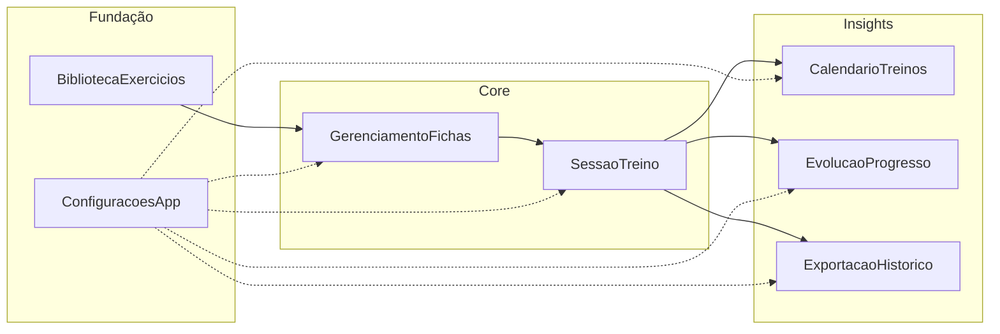

# Especificações de Features — Fitness Tracker

> **Origem:** `PRD.md`  
> **Versão do PRD:** 1.0  
> **Data da decomposição:** 2026-07-05  
> **Gerado por:** Product Owner (skill)

---

## Resumo

O PRD foi decomposto em **4 jornadas** e **7 features verticais** que cobrem 100% dos casos de uso Must do MVP. A fundação começa pela biblioteca de exercícios e gestão de fichas; o núcleo operacional é a sessão de treino (registro, timer e conclusão); insights vêm de calendário e evolução; polish transversal inclui configurações (i18n/unidades) e exportação. Todas as features são Must, exceto RF-18 e RF-19 (Should), absorvidos por SessaoTreino e CalendarioTreinos respectivamente.

---

## Jornadas do sistema

### Jornada 1 — Preparar e manter fichas de treino

| Campo | Descrição |
|-------|-----------|
| **Persona** | Praticante de musculação |
| **Gatilho** | Usuário precisa criar rotina nova ou ajustar ficha existente |
| **Resultado de negócio** | Ficha estruturada pronta para execução, com histórico anterior preservado |
| **Features** | BibliotecaExercicios, GerenciamentoFichas |

**Fluxo:**
1. Usuário acessa área de fichas/rotinas
2. Cria nova ficha ou seleciona existente para editar
3. Adiciona exercícios da biblioteca por grupo muscular
4. Define séries, faixa de reps e tempo de descanso por exercício
5. Salva ficha; treinos passados permanecem intactos

### Jornada 2 — Executar treino do dia

| Campo | Descrição |
|-------|-----------|
| **Persona** | Praticante de musculação |
| **Gatilho** | Usuário chega à academia e inicia o treino do dia |
| **Resultado de negócio** | Sessão registrada série a série, offline, com treino concluído e dia marcado |
| **Features** | SessaoTreino, CalendarioTreinos |

**Fluxo:**
1. Usuário seleciona ficha do dia
2. Registra reps e carga após cada série; timer de descanso inicia
3. Conclui exercícios um a um até finalizar todos
4. Botão **Concluir treino** habilita; usuário finaliza sessão
5. Calendário marca o dia automaticamente

### Jornada 3 — Analisar evolução e consistência

| Campo | Descrição |
|-------|-----------|
| **Persona** | Praticante de musculação |
| **Gatilho** | Usuário quer avaliar progresso ou frequência de treinos |
| **Resultado de negócio** | Visibilidade de carga, volume, PRs, gráficos e dias treinados |
| **Features** | EvolucaoProgresso, CalendarioTreinos |

**Fluxo:**
1. Usuário acessa evolução ou calendário
2. Seleciona exercício, período ou visão temporal
3. Consulta métricas e identifica progresso ou estagnação
4. Verifica dias treinados no calendário

### Jornada 4 — Configurar app e proteger dados

| Campo | Descrição |
|-------|-----------|
| **Persona** | Praticante de musculação |
| **Gatilho** | Usuário precisa ajustar idioma/unidades ou fazer backup do histórico |
| **Resultado de negócio** | App personalizado e histórico exportável |
| **Features** | ConfiguracoesApp, ExportacaoHistorico |

**Fluxo:**
1. Usuário acessa configurações e define idioma e unidades
2. App reflete preferências em toda a interface
3. Usuário exporta histórico completo em arquivo

---

## Mapa de features

| Feature | Pasta | Prioridade | Jornada(s) | Dependências bloqueantes | Status |
|---------|-------|------------|------------|--------------------------|--------|
| Biblioteca de Exercícios | `BibliotecaExercicios/` | Must | Preparar fichas | — | Rascunho |
| Gerenciamento de Fichas | `GerenciamentoFichas/` | Must | Preparar fichas | BibliotecaExercicios | Rascunho |
| Sessão de Treino | `SessaoTreino/` | Must | Executar treino | GerenciamentoFichas | Rascunho |
| Calendário de Treinos | `CalendarioTreinos/` | Must | Executar treino, Analisar evolução | SessaoTreino | Rascunho |
| Evolução e Progresso | `EvolucaoProgresso/` | Must | Analisar evolução | SessaoTreino | Rascunho |
| Exportação de Histórico | `ExportacaoHistorico/` | Must | Configurar e proteger | SessaoTreino | Rascunho |
| Configurações do App | `ConfiguracoesApp/` | Must | Configurar e proteger | — | Rascunho |

### Mapeamento UC → Feature

| Caso de uso | Feature(s) |
|-------------|------------|
| UC-01 Montar ficha de treino | BibliotecaExercicios, GerenciamentoFichas |
| UC-02 Executar treino e registrar séries | SessaoTreino |
| UC-03 Concluir treino | SessaoTreino, CalendarioTreinos |
| UC-04 Consultar evolução | EvolucaoProgresso |
| UC-05 Ver calendário de treinos | CalendarioTreinos |
| UC-06 Exportar histórico | ExportacaoHistorico |
| UC-07 Configurar idioma e unidades | ConfiguracoesApp |
| UC-08 Editar ficha existente | GerenciamentoFichas |

---

## Dependências entre features



### Matriz de dependências

| Feature | Depende de | Tipo | Observação |
|---------|------------|------|------------|
| BibliotecaExercicios | — | — | Fundação de dados; seed pré-populado |
| ConfiguracoesApp | — | Paralela | Integra com todas as UIs; iniciar cedo |
| GerenciamentoFichas | BibliotecaExercicios | Bloqueante | Seleciona exercícios da biblioteca |
| SessaoTreino | GerenciamentoFichas | Bloqueante | Executa ficha existente |
| CalendarioTreinos | SessaoTreino | Integração | Consome eventos de conclusão (RN-04) |
| EvolucaoProgresso | SessaoTreino | Integração | Consome histórico de séries/sessões |
| ExportacaoHistorico | SessaoTreino | Integração | Serializa histórico de sessões |

---

## Ordem sugerida de implementação

1. **BibliotecaExercicios** — fundação; desbloqueia montagem de fichas (RF-01)
2. **ConfiguracoesApp** — i18n e unidades desde o início; evita retrabalho (RF-15, RF-16)
3. **GerenciamentoFichas** — valor imediato; substitui bloco de notas na preparação (UC-01, UC-08)
4. **SessaoTreino** — núcleo do produto; registro offline série a série (UC-02, UC-03)
5. **CalendarioTreinos** — frequência visível após primeiras sessões (UC-05)
6. **EvolucaoProgresso** — insights após histórico mínimo (UC-04)
7. **ExportacaoHistorico** — proteção de dados local (UC-06)

### Paralelização possível

- **Onda 1 (paralelo):** BibliotecaExercicios, ConfiguracoesApp
- **Onda 2 (após Onda 1):** GerenciamentoFichas
- **Onda 3 (após Onda 2):** SessaoTreino
- **Onda 4 (após Onda 3, paralelo):** CalendarioTreinos, EvolucaoProgresso, ExportacaoHistorico

---

## Cobertura do escopo MVP (PRD)

| Item do escopo MVP (PRD) | Feature(s) |
|--------------------------|------------|
| Biblioteca de exercícios por grupo muscular | BibliotecaExercicios |
| Exercícios customizados criados pelo usuário | BibliotecaExercicios |
| Criação, edição e troca de fichas | GerenciamentoFichas |
| Registro série a série | SessaoTreino |
| Timer de descanso configurável | SessaoTreino |
| Conclusão de treino com regra de desbloqueio | SessaoTreino |
| Calendário de dias treinados | CalendarioTreinos |
| Evolução (carga, volume, PRs, gráficos) | EvolucaoProgresso |
| Armazenamento local offline (SQLite) | Todas (RF-13 transversal) |
| Exportação de histórico | ExportacaoHistorico |
| Configurações (i18n, unidades, alerta timer) | ConfiguracoesApp |
| App multiplataforma | Transversal (arquitetura) |

### Fora de escopo (PRD)

- Personal trainer / multiusuário
- Login, nuvem e sincronização
- Importação do bloco de notas
- Vídeos/instruções de exercícios
- Notificações push
- Backup automático em nuvem

---

## Integrações e sistemas externos

| Sistema | Features impactadas | Observação |
|---------|---------------------|------------|
| SQLite | Todas | Persistência local offline (RF-13) |
| Sistema de arquivos do SO | ExportacaoHistorico | Salvar/compartilhar arquivo |
| Framework i18n | ConfiguracoesApp + todas as UIs | Traduções pt-BR, es-ES, en-US |

---

## Riscos e lacunas do PRD

| Item | Tipo | Impacto | Ação sugerida |
|------|------|---------|---------------|
| Versões mínimas iOS/Android | Lacuna técnica | Baixo | Confirmar na fase de arquitetura |
| Timer em background/minimizado | Lacuna técnica | Médio | Definir na fase de arquitetura |
| Quantidade de exercícios no seed | Curadoria | Baixo | Definir na curadoria do seed |
| RF-13 não é feature isolada | Premissa | — | SQLite tratado como requisito transversal em cada feature |

---

## Estrutura de pastas

```
.specs/
├── index.md
├── BibliotecaExercicios/
│   └── feature.md
├── GerenciamentoFichas/
│   └── feature.md
├── SessaoTreino/
│   └── feature.md
├── CalendarioTreinos/
│   └── feature.md
├── EvolucaoProgresso/
│   └── feature.md
├── ExportacaoHistorico/
│   └── feature.md
└── ConfiguracoesApp/
    └── feature.md
```

---

## Próximos passos

1. ~~Responder perguntas em aberto de produto~~ ✓
2. ~~Arquitetura baseline~~ → `.specs/architecture.md` ✓
3. ~~Arquitetura baseline~~ → `.specs/architecture.md` ✓
4. ~~Módulos + tasks mobile~~ → `.specs/modules.md` + `.specs/tasks_mobile.md` ✓
5. Invocar **`dev`** — iniciar MO-001 (scaffold Expo)
