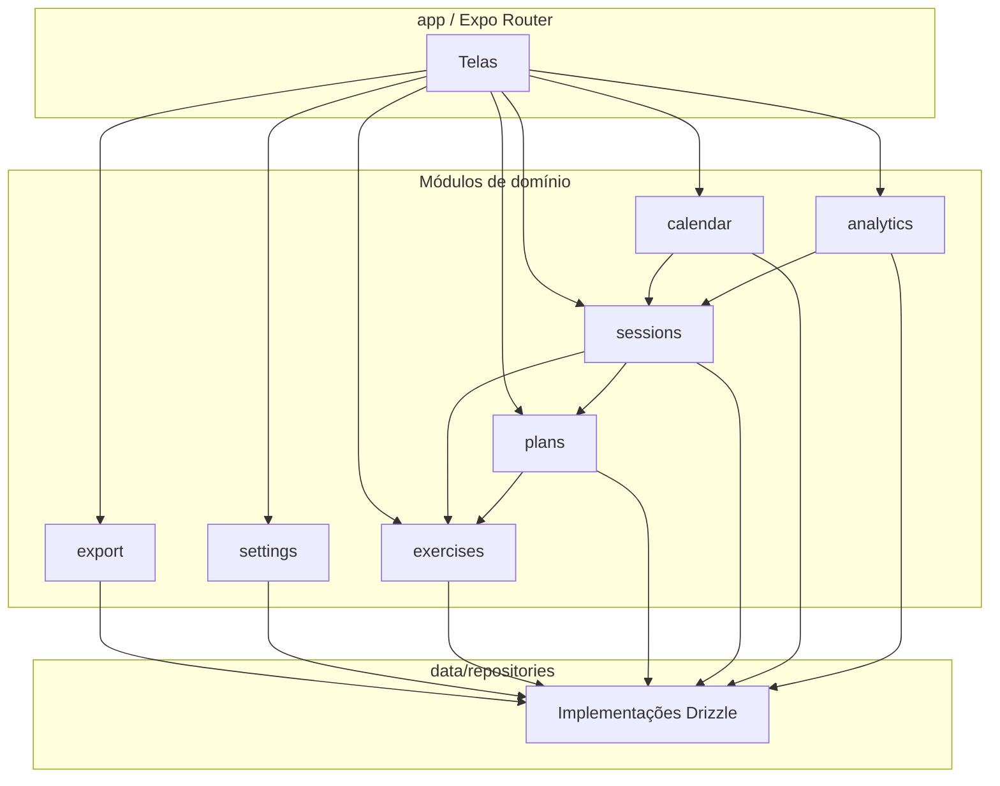

# Módulos — Fitness Tracker (Sistema)

> **Escopo:** Baseline global — 7 features em `.specs/`  
> **Arquitetura:** `.specs/architecture.md`  
> **Estilo alvo:** App mobile monolítico modular (Clean Architecture)  
> **Data:** 2026-07-05  
> **Gerado por:** Engenheiro de Software (skill)

---

## Resumo

O sistema é um **único app Expo** organizado em **7 módulos de domínio** (bounded contexts), cada um com entidades, interfaces de repositório, use cases e implementação Drizzle. A camada `app/` (Expo Router) consome apenas use cases. Infraestrutura transversal (`notifications`, `export`, `seed`, `i18n`, `lib/units`) fica em `src/infrastructure/` e `src/shared/`. Não há backend — extração futura para microserviços é **não aplicável no MVP**; fronteiras de módulo permitem evolução modular dentro do monolito.

---

## Princípios de organização

- **Um módulo = um bounded context** com ownership exclusivo de suas entidades.
- **Comunicação entre módulos** via interfaces de repositório e use cases — nunca import de `data/repositories/` de outro módulo a partir de UI.
- **Camadas fixas:** `domain` (puro) → `data` (Drizzle) → `app` (UI) → `infrastructure` (SO).
- **Convenções do repo:** ver `.specs/architecture.md` — paths em `src/domain/`, `src/data/`, `src/modules/` como alias lógico.

### Estrutura física por módulo

```
src/
├── domain/
│   ├── entities/           # Compartilhado — tipos por módulo em subpastas
│   ├── repositories/       # IExerciseRepository.ts, IPlanRepository.ts...
│   └── use-cases/
│       ├── exercises/      # Módulo exercises
│       ├── plans/
│       ├── sessions/
│       ├── calendar/
│       ├── analytics/
│       ├── export/
│       └── settings/
├── data/
│   ├── db/schema.ts        # Todas as tabelas (migrations únicas)
│   ├── repositories/       # Uma impl por interface
│   └── mappers/
├── infrastructure/         # Cross-cutting técnico
├── shared/                 # UI components, hooks, DI container
└── stores/                 # Zustand (sessão ativa, timer UI)
```

---

## Mapa de módulos

| Módulo | Status | Caminho principal | Responsabilidade | Entidades donas | Feature `.specs/` |
|--------|--------|-------------------|------------------|-----------------|-------------------|
| `settings` | Criar | `use-cases/settings/` | Locale, unidades, alerta timer | `UserSettings` | ConfiguracoesApp |
| `exercises` | Criar | `use-cases/exercises/` | Biblioteca seed + custom | `Exercise` | BibliotecaExercicios |
| `plans` | Criar | `use-cases/plans/` | Fichas e exercícios planejados | `WorkoutPlan`, `PlanExercise` | GerenciamentoFichas |
| `sessions` | Criar | `use-cases/sessions/` | Sessão, séries, conclusão | `WorkoutSession`, `SessionExercise`, `SetLog` | SessaoTreino |
| `calendar` | Criar | `use-cases/calendar/` | Dias treinados, sessões por data | — (read-only de sessions) | CalendarioTreinos |
| `analytics` | Criar | `use-cases/analytics/` | Carga, volume, PRs, séries para gráficos | — (read-only de set_logs) | EvolucaoProgresso |
| `export` | Criar | `use-cases/export/` | Dump JSON/CSV | — (read all) | ExportacaoHistorico |

### Módulos de infraestrutura (suporte)

| Módulo | Caminho | Responsabilidade |
|--------|---------|------------------|
| `database` | `src/data/db/` | Schema Drizzle, client, migrations |
| `notifications` | `src/infrastructure/notifications/` | RestTimerService (ADR-005) |
| `i18n` | `src/i18n/` | i18next, locales, exercise keys |
| `shared-ui` | `src/ui/`, `src/shared/hooks/` | Componentes reutilizáveis |

---

## Fronteiras e dependências entre módulos



| De | Para | Tipo | Contrato | Permitido? |
|----|------|------|----------|------------|
| `plans` | `exercises` | Sync | `IExerciseRepository.getById` | Sim |
| `sessions` | `plans` | Sync | `IPlanRepository.getWithExercises` | Sim |
| `calendar` | `sessions` | Sync | `ISessionRepository.listCompletedByMonth` | Sim |
| `analytics` | `sessions` | Sync | `IAnalyticsRepository` (queries em set_logs) | Sim |
| `export` | todos | Sync | Repositórios read-only | Sim |
| `app/` | `data/repositories/` | Import direto | — | **Não** — só use cases |
| `calendar` | `data/db/schema` | Import direto SQL | — | **Não** — via repository |

### Regras de dependência

- [x] `domain/` não importa `app/`, `data/` ou `infrastructure/`
- [x] Use cases recebem repositórios via **injeção** (`src/shared/di/container.ts`)
- [x] `WorkoutSession` e `SetLog` persistidos **apenas** pelo módulo `sessions`
- [x] `calendar` e `analytics` são **read models** — sem writes próprios

---

## API pública por módulo

> Superfície exposta a telas (`app/`) e outros use cases.

| Módulo | Tipo | Nome | Descrição |
|--------|------|------|-----------|
| `settings` | Use case | `GetSettingsUseCase` | Lê preferências |
| `settings` | Use case | `UpdateSettingsUseCase` | Atualiza locale, units, timerAlert |
| `exercises` | Use case | `ListExercisesByGroupUseCase` | Lista por grupo muscular |
| `exercises` | Use case | `SearchExercisesUseCase` | Busca por texto |
| `exercises` | Use case | `CreateCustomExerciseUseCase` | RF-20 |
| `plans` | Use case | `CreatePlanUseCase` | Nova ficha |
| `plans` | Use case | `UpdatePlanUseCase` | Editar ficha (RN-03 preserva histórico) |
| `plans` | Use case | `ArchivePlanUseCase` | Arquivar — sem delete |
| `plans` | Use case | `DuplicatePlanUseCase` | Duplicar ficha |
| `plans` | Use case | `ListActivePlansUseCase` | Fichas ativas |
| `sessions` | Use case | `StartSessionUseCase` | Snapshot plano → session_exercises (ADR-003) |
| `sessions` | Use case | `LogSetUseCase` | Registra série + agenda timer |
| `sessions` | Use case | `CompleteExerciseUseCase` | Marca exercício concluído |
| `sessions` | Use case | `CompleteSessionUseCase` | RN-01, RN-04 |
| `sessions` | Use case | `GetActiveSessionUseCase` | Retomada RF-18 |
| `calendar` | Use case | `GetCalendarMonthUseCase` | Dias + contador |
| `calendar` | Use case | `GetSessionsByDateUseCase` | Detalhe ao tocar dia |
| `analytics` | Use case | `GetLoadHistoryUseCase` | RF-09, RF-12 |
| `analytics` | Use case | `GetWeeklyVolumeUseCase` | RF-10 |
| `analytics` | Use case | `GetPersonalRecordsUseCase` | RF-11, RN-06/06b |
| `export` | Use case | `ExportFullDumpUseCase` | JSON ou CSV |
| `notifications` | Service | `RestTimerService` | schedule / cancel (ADR-005) |

### Interfaces de repositório

| Interface | Arquivo | Módulo dono |
|-----------|---------|-------------|
| `ISettingsRepository` | `domain/repositories/ISettingsRepository.ts` | settings |
| `IExerciseRepository` | `domain/repositories/IExerciseRepository.ts` | exercises |
| `IPlanRepository` | `domain/repositories/IPlanRepository.ts` | plans |
| `ISessionRepository` | `domain/repositories/ISessionRepository.ts` | sessions |
| `ICalendarRepository` | `domain/repositories/ICalendarRepository.ts` | calendar |
| `IAnalyticsRepository` | `domain/repositories/IAnalyticsRepository.ts` | analytics |

---

## Distribuição por frente (mobile)

| Módulo | Bootstrap | Data | Core UI | Workout | Insights | Export | Polish |
|--------|-----------|------|---------|---------|----------|--------|--------|
| `database` | ✓ | ✓ | | | | | |
| `settings` | | ✓ | ✓ | | | | |
| `exercises` | seed | ✓ | ✓ | | | | |
| `plans` | | ✓ | ✓ | | | | |
| `sessions` | | ✓ | | ✓ | | | |
| `notifications` | | | | ✓ | | | |
| `calendar` | | | | | ✓ | | |
| `analytics` | | | | | ✓ | | |
| `export` | | | | | | ✓ | |
| `shared-ui` / i18n | ✓ | | ✓ | ✓ | ✓ | ✓ | ✓ |

---

## Extração futura (readiness)

| Módulo | Pronto para microserviço? | Observação |
|--------|---------------------------|------------|
| Todos | N/A no MVP | App offline local; microserviços não planejados |
| Fronteiras internas | Sim | Use cases + interfaces permitem refatorar módulos sem quebrar UI |

---

## Rastreabilidade

| Referência | Módulo(s) |
|------------|-----------|
| RF-01, RF-20 | `exercises` |
| RF-02, RF-03, RF-17, RN-03 | `plans` |
| RF-04–07, RF-18, RN-01, RN-04, RN-05 | `sessions` |
| RF-08, RF-19 | `calendar` |
| RF-09–12, RN-06, RN-06b | `analytics` |
| RF-14 | `export` |
| RF-15, RF-16, RF-21, RN-02 | `settings` |
| RF-13 | `database` + todos repositórios |

---

## Premissas

- [PREMISSA] DI simples via factory em `src/shared/di/container.ts` — sem framework pesado
- [PREMISSA] Um único arquivo `schema.ts` — ownership lógico por módulo, migrations centralizadas
- [PREMISSA] Telas em `app/` mapeiam 1:1 às tabs da ADR-006

---

## Perguntas em aberto

| # | Pergunta | Impacto | Bloqueia |
|---|----------|---------|----------|
| 1 | CSV flat vs ZIP | Baixo | MO-071 (export) |
| 2 | UX soft-delete custom exercise | Baixo | MO-034 |
